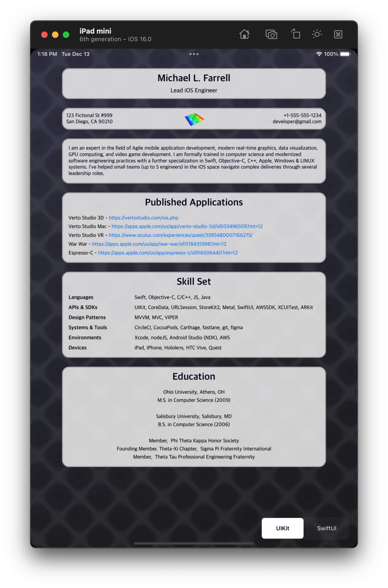
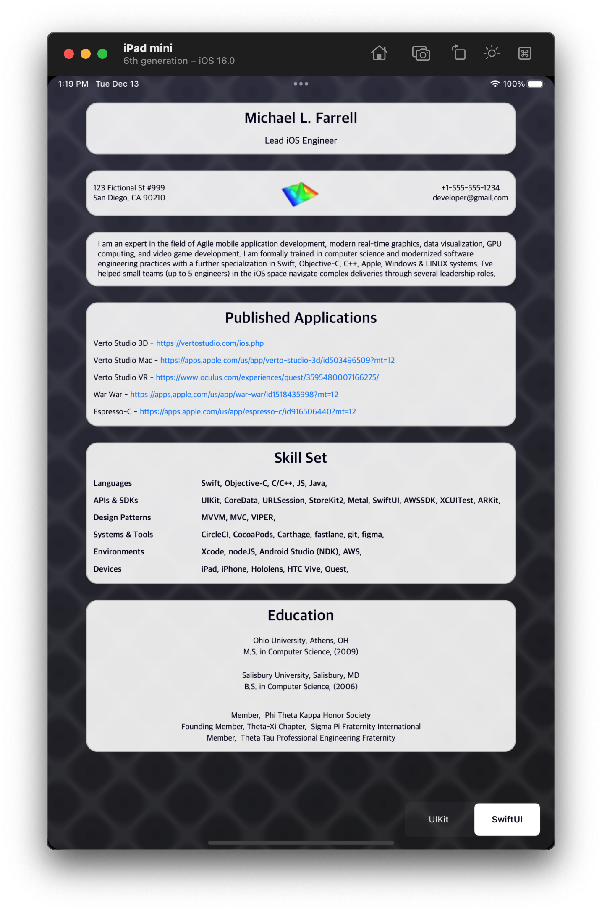

## Resume As A Service
This repo is a code sample for iOS development.  It demonstrates a parallel data fetch (in this case, resume data) from a local node service.  The frontend is dual-implemented using both programmatically generated UIKit views and SwiftUI views that share a common ViewModel.  The network operations are implemented using modern Concurrency APIs at the time of this writing.

Being that this is a public repository, please note that certain fields such as contact information & work history are intentionally omitted for privacy and non-disclosure purposes.  Contact me directly for a more thorough traditional resume format.

<table border="0">
<tr>
<td>

</td>
<td>

</td>
</tr>
</table>
